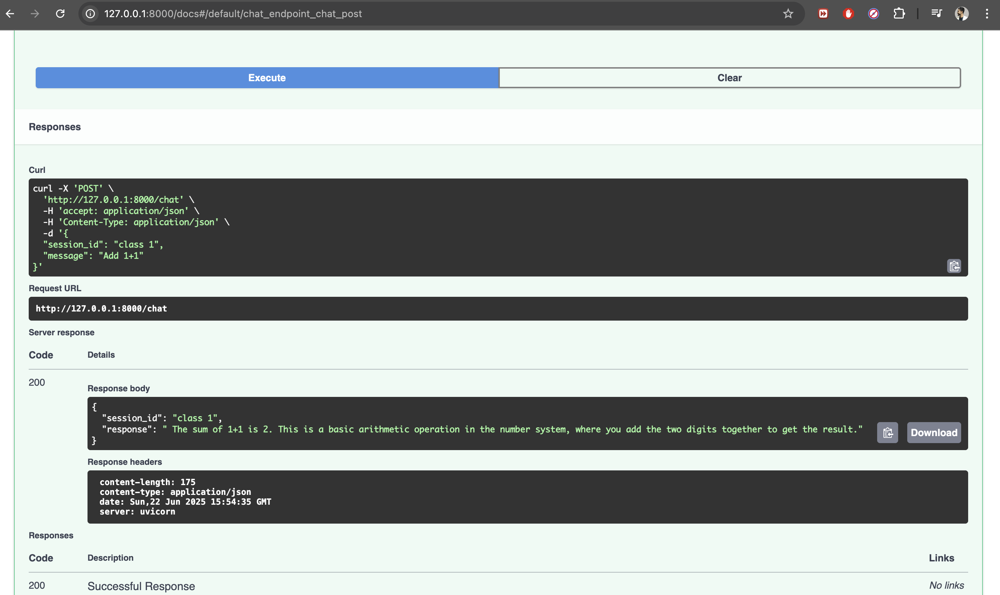

# 🎓 Class 1–10 Student Tutor Chatbot (FastAPI + OpenRouter)

This is a FastAPI-based intelligent chatbot that acts as a virtual tutor for students from **Class 1 to Class 10**. It utilizes **free instruction-following LLMs** provided by **OpenRouter** (like Mistral-7B-Instruct or DeepSeek LLaMA 70B) to deliver clear, helpful answers in markdown format. The chatbot maintains **in-memory chat sessions** and is deployed on **Render.com**.

---

## 🌐 Live Deployment

🔗 **API Base URL**: `https://chatbot-1-np4y.onrender.com/`  
📘 **Swagger UI**: `https://chatbot-1-np4y.onrender.com/docs`  

> Replace the above URLs with your actual Render deployment link after deployment.

---

## 🚀 Features

- ✅ Powered by OpenRouter LLMs (free access)
- ✅ FastAPI backend (no frontend needed)
- ✅ Supports students in **Class 1 to Class 10**
- ✅ In-memory chat sessions (no database)
- ✅ Responses formatted in **Markdown**
- ✅ Public API with Swagger UI documentation

---

## 🧠 API Usage

### 📩 POST `/chat`

Use this endpoint to chat with the bot. It accepts a user message and class level, maintains the session, and responds in markdown format.

#### 🔸 Request Format:

```json
{
  "session_id": "unique-session-id",
  "message": "What is the water cycle?",
  "class_level": 5
}
```


## 🔐 Environment Variables
Create a .env file in your project directory to securely store your API key:

```env
OPENROUTER_API_KEY=your_api_key
```

### ⚙️ Local Development Setup
##### Follow the steps below to run the chatbot locally.

##### ✅ 1. Clone the Repository

git clone https://github.com/yourusername/student-tutor-chatbot.git
cd student-tutor-chatbot
##### ✅ 2. Create a Virtual Environment

```
python -m venv venv
source venv/bin/activate  # For macOS/Linux
venv\Scripts\activate     # For Windows
```

#### ✅ 3. Install Dependencies
```
pip install -r requirements.txt
```

#### ✅ 4. Set Up .env File
Create a .env file and add your OpenRouter API key:

```
touch .env
Inside .env: OPENROUTER_API_KEY="your_openrouter_api_key_here"
```

#### ✅ 5. Run the FastAPI Server
```
uvicorn main:app --reload
Now open: http://127.0.0.1:8000/docs
```

You can test the /chat endpoint interactively using Swagger UI

### The preview and Response will be like this:


